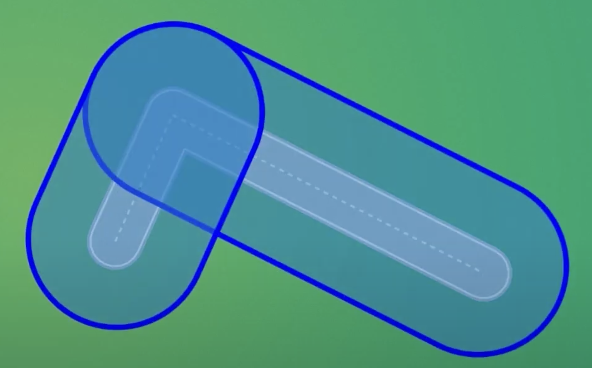
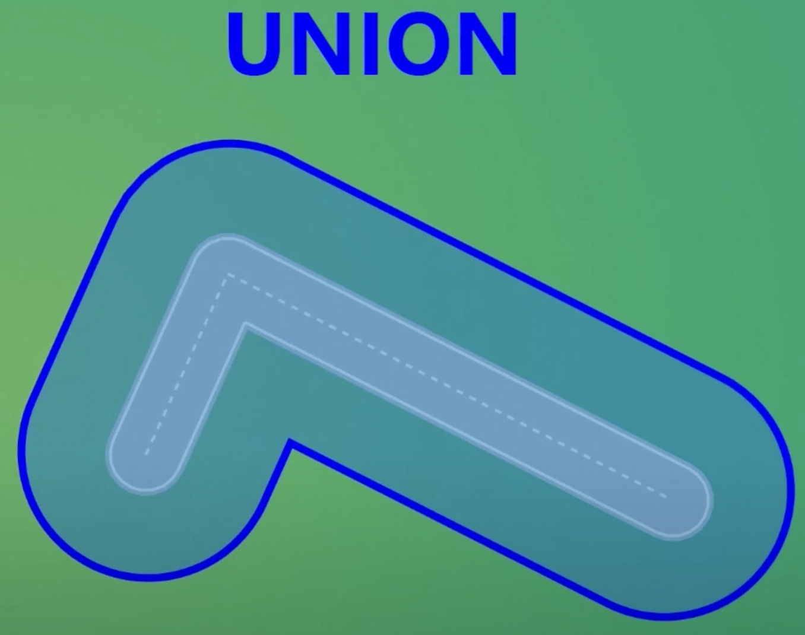
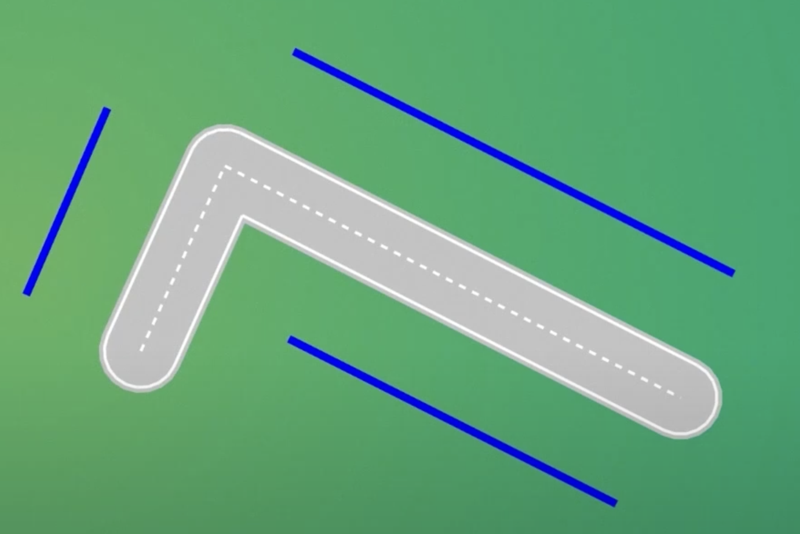
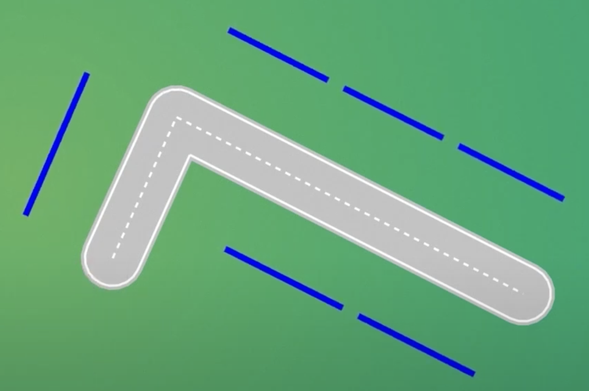
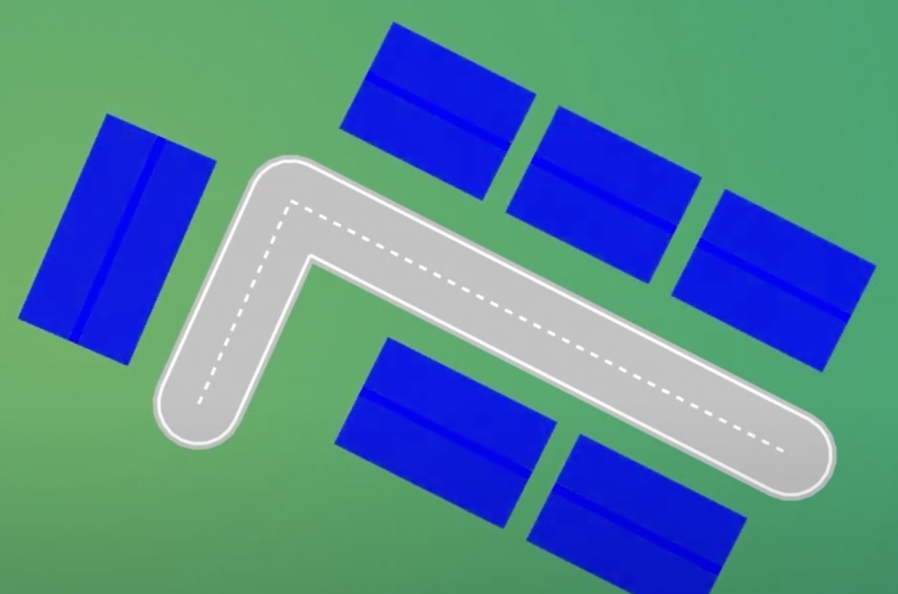
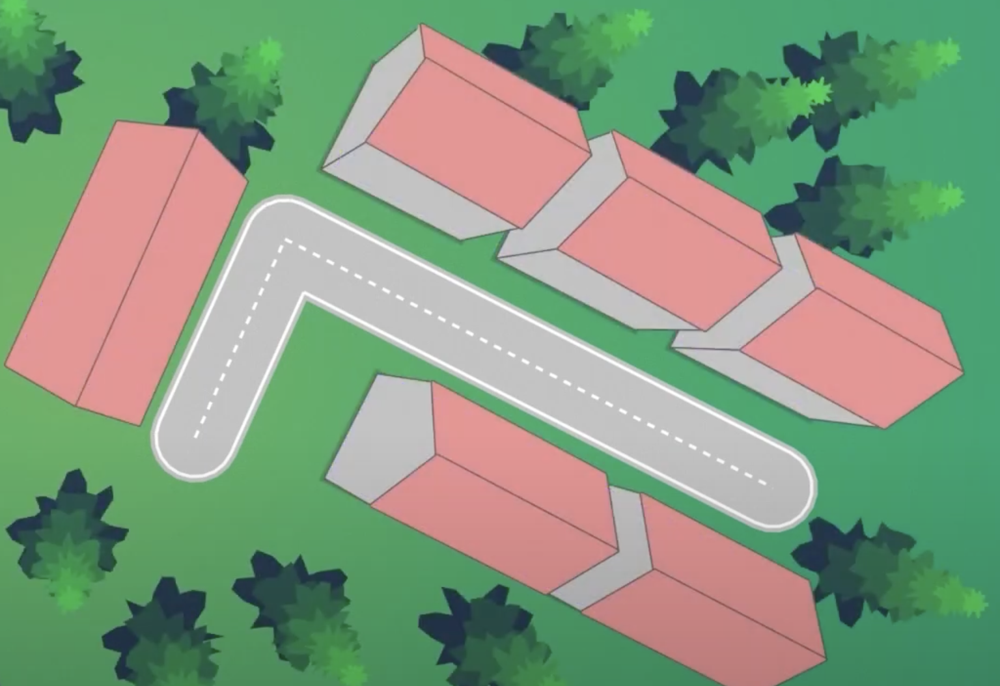

# Procedural Building Generation

## Overview

This document describes the procedural generation of buildings alongside roads using geometric algorithms.

## Step 1: Initial Road Structure

We start with a road network consisting of multiple segments:

## Step 2: Generate Thicker Envelopes

We generate thicker envelopes around the road segments to create building zones:

## Step 3: Union Operation

We use a union operation to obtain the outer segments, similar to the process used for road rendering:

## Step 4: Filter Building Support Segments

We keep only the roadside segments that are long enough to support at least one building:

## Step 5: Subdivide Long Segments

If segments are particularly long, we divide them into multiple support areas to accommodate more buildings:

## Step 6: Generate Building Polygons

We generate polygonal building footprints around each support area:

## Step 7: Fine-Tuning and Polish

Finally, we apply fine-tuning adjustments to create more realistic and aesthetically pleasing building layouts:

## Result

This procedural approach ensures that buildings are:

- Properly aligned with roads
- Appropriately sized for their locations
- Realistically distributed along street networks
- Optimized for visual appeal and urban planning principles
