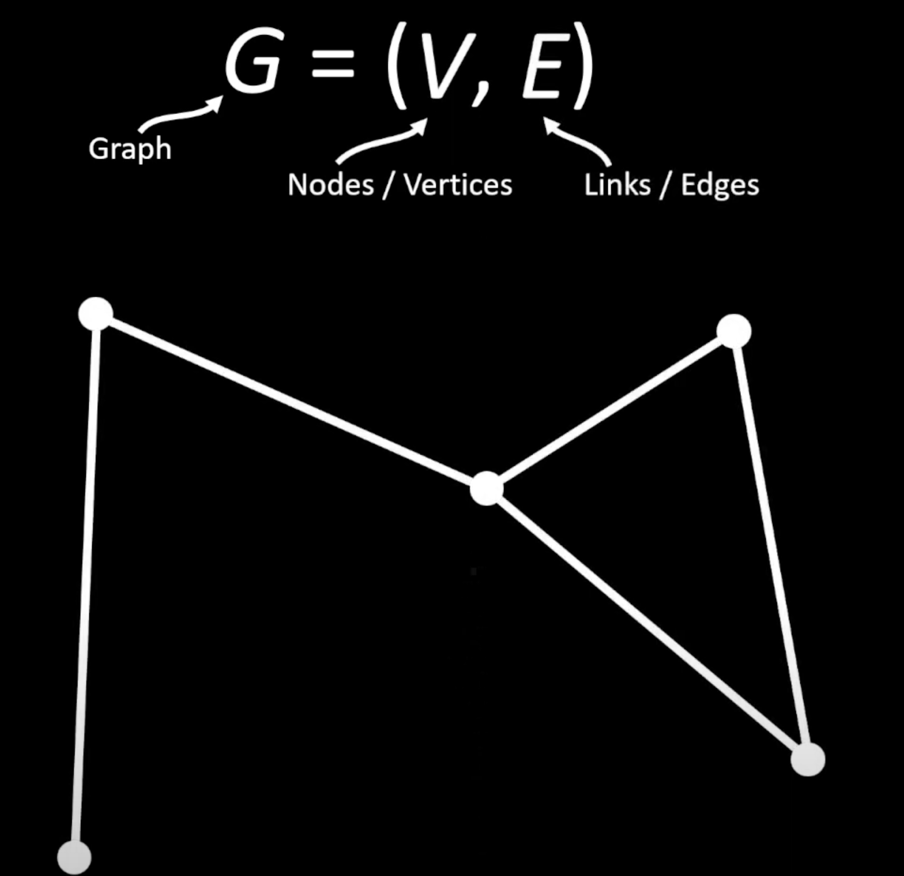
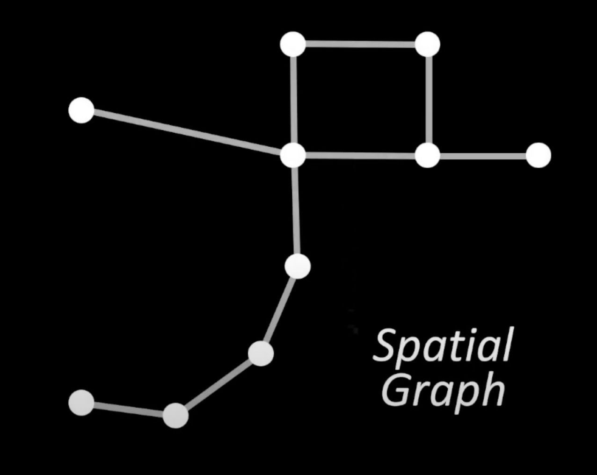
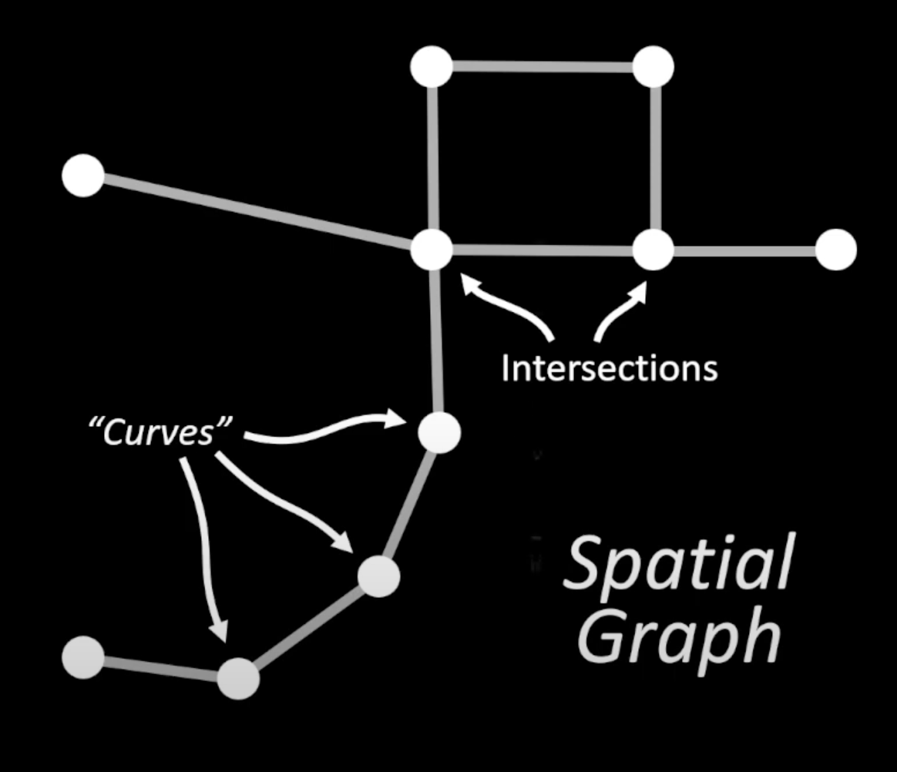
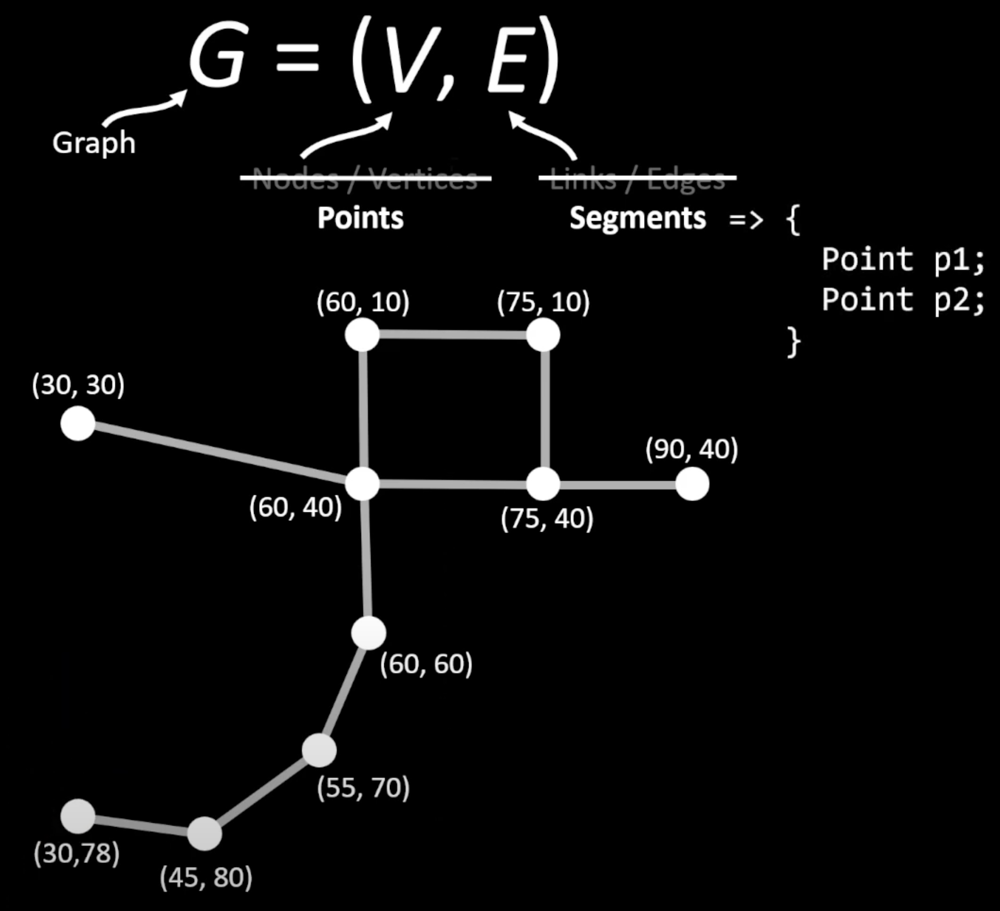

# Graph Data Structure

## Introduction

Graphs are data structures made from a set of **nodes** (also called vertices) and a set of **edges** (also called links) that represent relationships between the nodes.

## Spatial Graph Implementation

Here we are implementing a geometric graph called a **spatial graph**.

In this implementation:

- **Nodes** represent intersections or curves
- **Edges** connect these nodes to form the spatial relationships

## Why Spatial Graph?

We use a spatial graph because a matrix graph would be useless in this case, as it would be mostly empty due to the relatively few connections between nodes.

## Simplified Model

For the simplicity of this project, we can assume a graph is made of:

- **Points** (vertices/nodes)
- **Segments** (edges connecting point 1 to point 2)

