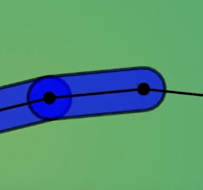
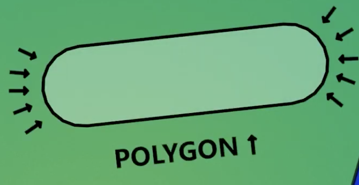
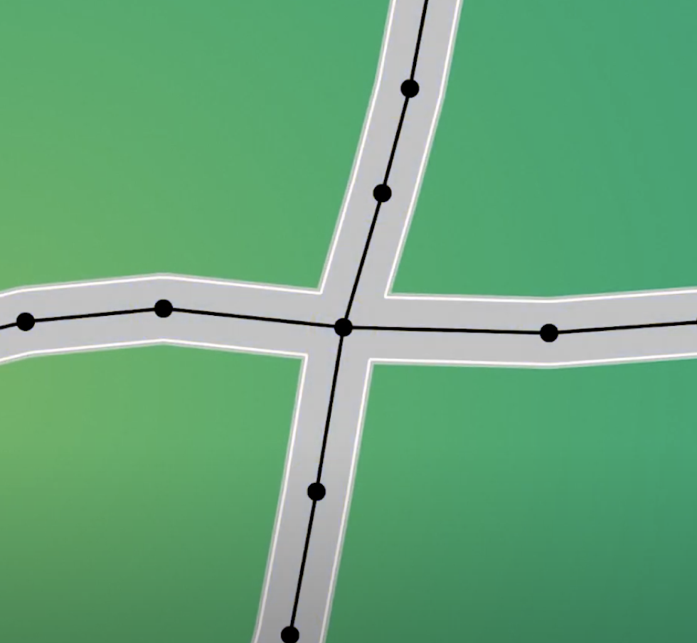

# Road Rendering

## Basic Road Representation

We can view a road as a simple line segment:

## Problem with Basic Approach

However, this is not what we want, as we need each road border to have the same thickness everywhere for a realistic appearance.

## Solution: Geometric Envelopes

We need to use geometry to wrap segments in **envelopes** (polygonal boundaries):

## Polygon Smoothing

These envelopes are essentially polygons with additional points to create smoother, more rounded appearances:

## Union Operation

Finally, we compute the **union** of these polygons to keep only the outer segments, creating a seamless road network:

This approach ensures consistent road width and creates realistic-looking intersections and curves.
